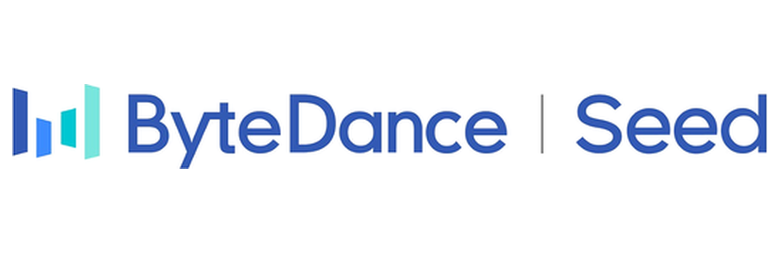

<div align="center">
  

  <p><strong>Bitwise Alignment for Precise and General Debugging of Production LLM Training</strong></p>

  <p>
    <a href="https://orderlab.io/OpGuard/"><strong>Website</strong></a>
    ·
    <a href="https://www.usenix.org/conference/osdi26/presentation/zhou-ziming"><strong>OSDI ’26</strong></a>
    ·
    <a href="#paper">Paper</a>
    ·
    <a href="#contact">Contact</a>
  </p>
</div>

---

OpGuard is a debugging system for large-scale LLM training. When two training runs diverge, it uses **bitwise alignment** to compare them at tensor boundaries and pinpoint the **first divergent operator**—turning vague loss-curve anomalies into precise, actionable evidence.

In production use at ByteDance, OpGuard has reduced root-cause localization from **days** of manual effort to **minutes**.


## Paper

OpGuard will appear at **[OSDI ’26](https://www.usenix.org/conference/osdi26/presentation/zhou-ziming)**:

> Ziming Zhou, Yinjie Zhao, Hang Zhu, Wenxiao Wang, Zhihao Bai, Yun Zhang, Shuguang Wang, Haibin Lin, Peng Huang.  
> *OpGuard: Bitwise Alignment for Precise and General Debugging of Production LLM Training.*  
> In *Proceedings of the 20th USENIX Symposium on Operating Systems Design and Implementation (OSDI ’26)*, Seattle, WA, USA, July 2026.

<details>
<summary><strong>BibTeX</strong></summary>

```bibtex
@inproceedings{OpGuard2026OSDI,
  author = {Zhou, Ziming and Zhao, Yinjie and Zhu, Hang and Wang, Wenxiao and Bai, Zhihao and Zhang, Yun and Wang, Shuguang and Lin, Haibin and Huang, Peng},
  title = {{OpGuard}: Bitwise Alignment for Precise and General Debugging of Production {LLM} Training},
  booktitle = {Proceedings of the 20th USENIX Symposium on Operating Systems Design and Implementation},
  series = {OSDI '26},
  month = {July},
  year = {2026},
  address = {Seattle, WA, USA},
  publisher = {USENIX Association},
}
```

</details>


## What’s on this site

| Section | Description |
| --- | --- |
| **Bitwise alignment** | Core abstraction for comparing training runs |
| **Live trace demo** | Explore divergence evidence in a Perfetto-style viewer |
| **Workflow** | How OpGuard fits into production debugging |
| **Impact** | Production case studies and timing results |


## Contact

Source code and internal tooling are **not publicly released**.

For questions about the paper, demos, or access inquiries, please **email the authors** listed above.

---

## About ByteDance Seed Team

<p align="center">
  <a href="https://seed.bytedance.com/en/">
    
  </a>
</p>

Founded in 2023, ByteDance Seed Team is dedicated to crafting the industry's most advanced AI foundation models. The team aspires to become a world-class research team and make significant contributions to the advancement of science and society.

---

<p align="center">
  
  <br />
  <sub><a href="https://www.usenix.org/conference/osdi26/presentation/zhou-ziming">OSDI ’26</a></sub>
</p>
